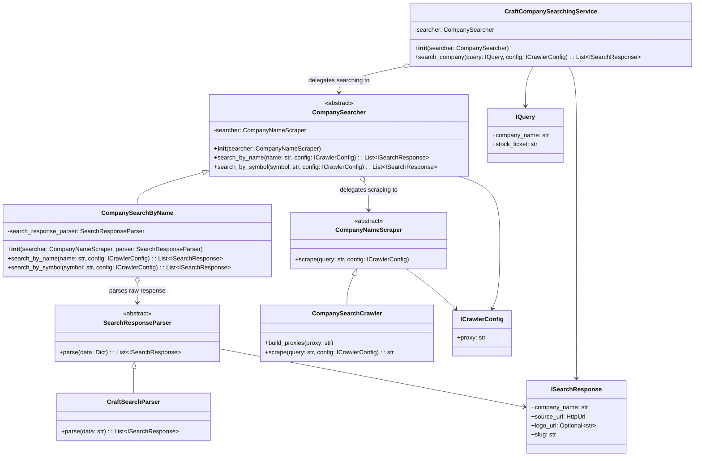
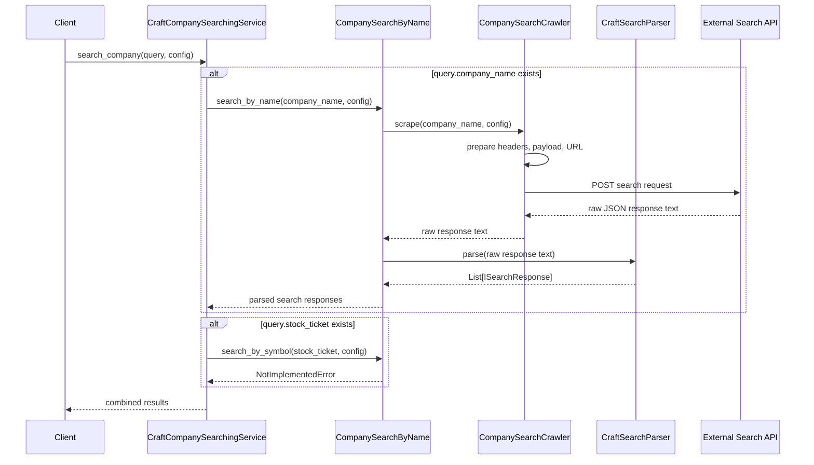
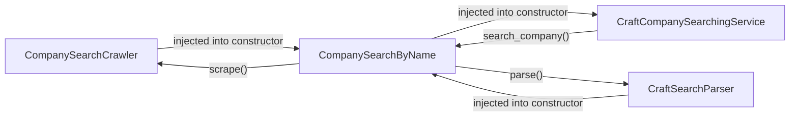
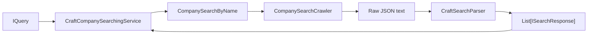

 

**Dependency injection setup**

**Runtime responsibility summary**

`CompanySearchCrawler` fetches data, `CraftSearchParser` transforms the raw JSON into `ISearchResponse` objects, and `CraftCompanySearchingService` returns the parsed responses. `CompanySearchByName` must receive both the crawler and parser so `self.search_response_parser` is initialized before `search_by_name()` is called.